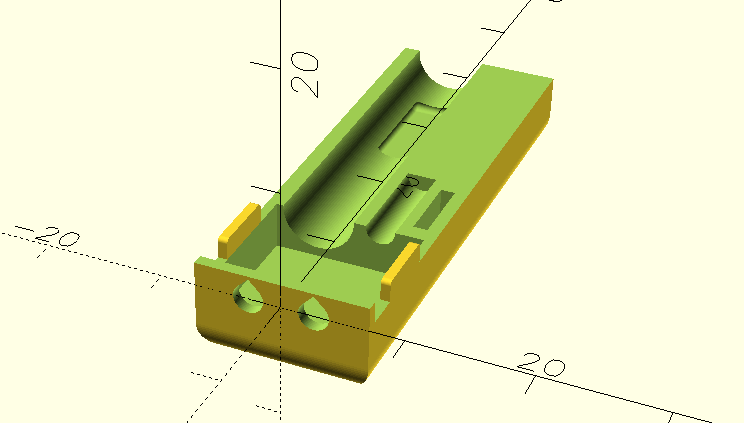
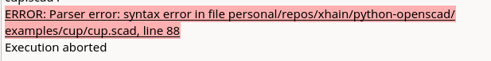
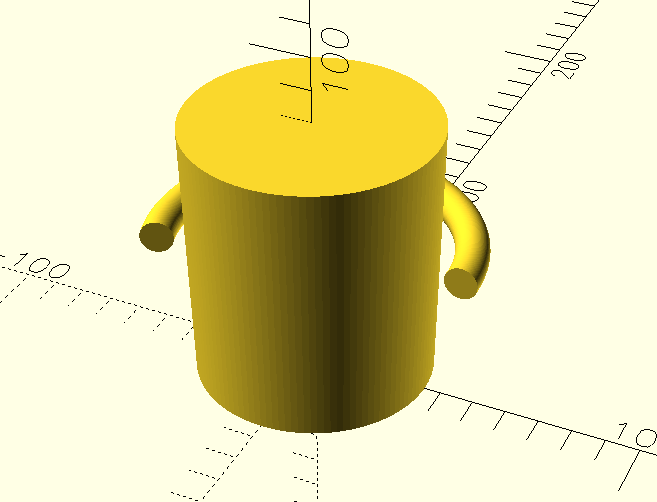
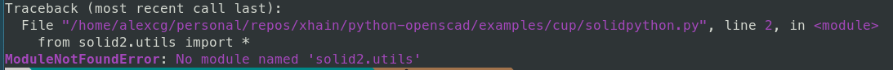

```python
title_text = text(text="Python for 3D Design")

title_text.save_as_scad("title.scad")
```

---

## Background

- Python developer - 10+ years
- Used lots of 3D design software - Rhino, Fusion360, FreeCAD (a bit)
- More of a programmer than a designer
- I live in my text editor
- Building animatronic butterfly jewelry project

---

## OpenSCAD: why I started using it

[OpenSCAD](https://openscad.org/) is a free CAD tool where you program your models instead of drawing them.

- **Open source** - no lock-in or licensing issues (I'm looking at you, Autodesk)
- **Works in text editor** - that's where I live
- **Can store stuff in git** - version control and remote storage
- **Programming-focused, rather than visual**


---

## Example


```scad
$fn = 100; // set cylinder resolution globally

// Cube with a hole along the Y-axis, cylinder shifted directly in translate
cube_size = 20;
hole_diameter = 7;

// Subtract cylindrical hole
difference() {
    cube(cube_size, center=true);
    translate([5, 0, 3])  // X=5, Y=0, Z=3
        rotate([90,0,0])  // align cylinder along Y-axis
        cylinder(d=hole_diameter, h=cube_size + 1, center=true);
}
```

---

## Can I round the top of the cube?

OpenSCAD doesn't support rounding out of the box. But how hard can it be?

### What I want


### What I get

GPT to the rescue?

| Attempt 1                               | Attempt 2                               | Attempt 3                               |
| --------------------------------------- | --------------------------------------- | --------------------------------------- |
|  |  |  |

### Code from attempt 3

```scad
$fn = 100;

cube_size = 20;
hole_diameter = 7;
round_radius = 3;  // radius for top corners

difference() {
    union() {
        // Bottom: plain cube
        translate([0, 0, -round_radius/2])
            cube([cube_size, cube_size, cube_size - round_radius], center=true);

        // Top: flat plate + quarter cylinders for rounded corners
        translate([0, 0, cube_size/2 - round_radius])
            union() {
                // Top flat part
                cube([cube_size - 2*round_radius, cube_size, round_radius], center=true);
                cube([cube_size, cube_size - 2*round_radius, round_radius], center=true);

                // Quarter cylinders in each corner
                for (x = [-1, 1], y = [-1, 1]) {
                    translate([x*(cube_size/2 - round_radius),
                               y*(cube_size/2 - round_radius), 0])
                        cylinder(r=round_radius, h=round_radius, center=true);
                }
            }
    }

    // Hole after rounding
    translate([5, 0, 3])
        rotate([90, 0, 0])
        cylinder(d=hole_diameter, h=cube_size + 2, center=true);
}
```

Phew, that's a lot of code that doesn't even work!

---

## Enter BOSL2


[Belfry OpenSCAD Library v2](https://github.com/BelfrySCAD/BOSL2) extends OpenSCAD with:

- Rounding and filleting
- Shorthands - `up(3)` instead of `translate([0, 0, 3]`)
- Parts library - screws, threads, gears, hinges, clips
- And much more

---

## Rounding the cube with BOSL2


```scad
include <BOSL2/std.scad>;

$fn = 100; // global resolution

cube_size = 20;
hole_diameter = 7;
rounding = 3;

difference() {
    // Round top-front edge only
    cuboid([cube_size, cube_size, cube_size], rounding=rounding, edges=[TOP]);

    right(5)
        up(3)
            ycyl(d=hole_diameter, h=cube_size + 1);
}
```

---

## Why I (sorta) stopped using OpenSCAD

I mean, I use it more indirectly now, which we'll go over later

- **Declarative** - not object-oriented. if I want to copy an object I literally have to copy all the code
- **Verbose** - it's difficult to keep track of where I am in the file since there's so much stuff
- **Can't integrate with other stuff** - even with BOSL and other libraries, it can only go so far
- **I speak Python** - Something Python-based would just be easier

---

## Enter SolidPython

[SolidPython](https://github.com/jeff-dh/SolidPython) is a Python frontend for solid modelling that compiles to OpenSCAD.

- **More intuitive** - for me at least, since I'm a Python programmer anyway
- **Integrates BOSL2 and other OpenSCAD libraries** - so we lose nothing in the transition
- **Object-oriented** - can easily copy and modify objects instead of writing lots of code
- **Can integrate other Python libraries** - e.g. I used to print datestamps into prototypes to keep track of what's what
- **Can export directly to STL** - saves a step

But:

- **Docs aren't great** - I often refer to BOSL2 wiki and adapt from there. Even so...
- **I still don't know how to do some stuff** - aligning objects is beyond me
- **May generate verbose OpenSCAD files**

> [!TIP]
> Be sure to get **SolidPython2** (not `master` branch)


```python
from solid2.extensions.bosl2 import cuboid, ycyl, TOP
from solid2 import set_global_fn

set_global_fn(100)

cube_size = 20
hole_diameter = 7
rounding = 3

cube = cuboid(cube_size, rounding=rounding, edges=TOP)
hole = ycyl(d=hole_diameter, l=cube_size).right(5).up(3)

model = cube - hole

model.save_as_scad("model.scad")
model.save_as_stl("model.stl")
```

---

## A real project: My butterfly's body



- Lots of precise geometry
- A lot of object duplication
- Fixed anchor point (thanks BOSL2!)

Would be a nightmare for me to make in OpenSCAD directly, even with BOSL2

[Python code here](./examples/body/body.py)

---

## Can we use an LLM to create 3D models?

- As we've seen, ChatGPT struggles with spatial awareness - a common failing of LLMs
- Even so, let's ask it to `create a coffee cup in OpenSCAD`



Let's try again...



OK, but maybe let's try with SolidPython: `research the solidpython2 library and create a coffee cup`



Even after searching and reading the docs, it fails at the first hurdle.

So, in short, **no**, we can't use LLMs (in my experience) to generate even simple 3D models.

---

## Tips

### General

- Use proper editor on right side of screen, OpenSCAD preview on left
- Use [OpenSCAD development snapshot](https://openscad.org/downloads.html#snapshots) - much much faster rendering, more features

### BOSL2

- Take time to read the wiki, not just for if you need specific help - that let me know the power behind the library
- `teardrop()` is fantastic for 3D-printing vertical holes
- `cyl`, `xcyl`, `ycyl`, etc

### SolidPython

- Don't use `.save_to_stl()` when rapid prototyping - it can take a lot of time and sometimes crash (since your model may have issues)
- Import `solid2.extensions.bosl2` stuff _after_ importing `solid2` stuff to ensure you're using the BOSL stuff
- Use `get_name()` (defined in [`helper.py`](./examples/body/helper.py)) to name your output files after your working file

---

## Q + A

---

## Contact me

@alexcg on Matrix
